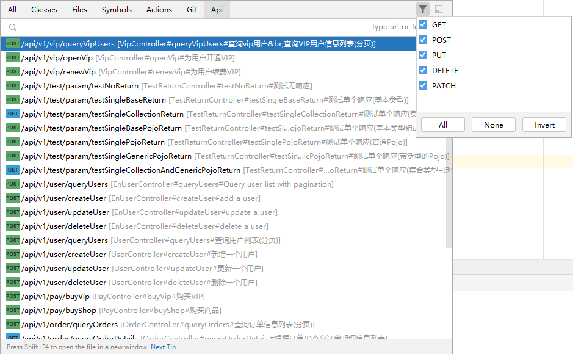
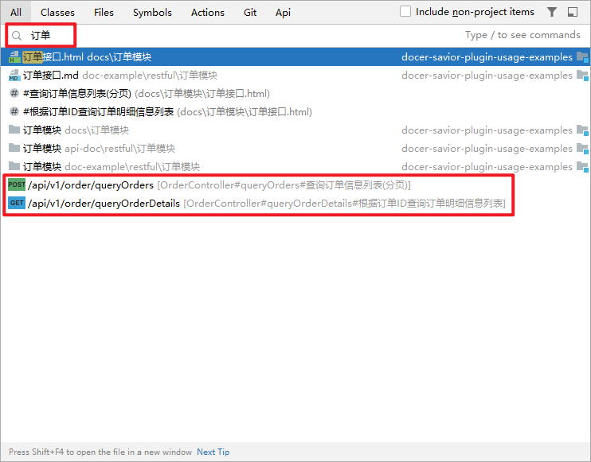

[release-img]: https://img.shields.io/github/release/docer-savior/search-everywhere-api-idea-plugin.svg
[latest-release]: https://github.com/docer-savior/search-everywhere-api-idea-plugin/releases/latest
[plugin-img]: https://img.shields.io/badge/plugin-19251-orange.svg
[plugin]: https://plugins.jetbrains.com/plugin/19251
[jet-img]: https://img.shields.io/badge/plugin-Install%20Plugin-4597ff.svg
[jet]: http://localhost:63342/api/installPlugin?action=install&pluginId=gudqs7.github.io.search.everywhere.api

[](CODE_OF_CONDUCT.md)
[](LICENSE)
[![GitHub release][release-img]][latest-release] [![Jetbrains Plugins][plugin-img]][plugin]
[][plugin]
[][plugin]
[![Install Plugins][jet-img]][jet]

---
[Chinese 🇨🇳](./README.md)

# What does Search Everywhere Api do?

- is an IDEA plugin that supports Java only.
- Search APIs via Search Everywhere.

# How do I get started?

## 1. Install the plugin
### zip package installation
Download the zip package from the latest [Release][latest-release] page, then open IDEA, go to Settings --> Plugins --> Pinion --> Install Plugin from Disk


### Marketplace Installation
Open IDEA, go to Settings --> Plugins, select Marketplace, enter Search Everywhere Api and click Install


## 2. Open a Spring MVC or Dubbo project
It is recommended to open the example project I specially prepared: [docer-savior-plugin-usage-examples](https://github.com/docer-savior/docer-savior-plugin-usage-examples)

```shell
git clone https://github.com/docer-savior/docer-savior-plugin-usage-examples
````

## 3. Search APIs through Search Everywhere

Double-click `Shift` to enter `Search Everywhere` and switch to Api, or use the shortcut keys `Ctrl + \ ` or `Ctrl + Alt + N` to enter the interface as shown below.
At this point you can search and jump to the interface by url or interface description.

  
When no data is entered, all APIs are displayed; in addition, it can be filtered by method type.  
  
You can also search under All  
  


# Where can I get more help if needed?

## Get help by submitting an issue
[Click to visit Github Issue](https://github.com/docer-savior/search-everywhere-api-idea-plugin/issues)
> Everyone is welcome to ask questions, and everyone is welcome to improve it together!

**In addition, I have connected to the error handling component of IDEA, so when I find an error message from the plugin, follow the IDEA prompt to view the error information and report it to me with one click (that is, an issue is automatically generated)**

## See the wiki for more instructions

[Click to visit Wiki](https://github.com/docer-savior/search-everywhere-api-idea-plugin/wiki/Getting-Started)

## Contribution Guidelines
[Contribution Guidelines](CONTRIBUTING_CN.md)

# Acknowledgments

- [Github RESTKit](https://github.com/newhoo/RESTKit)